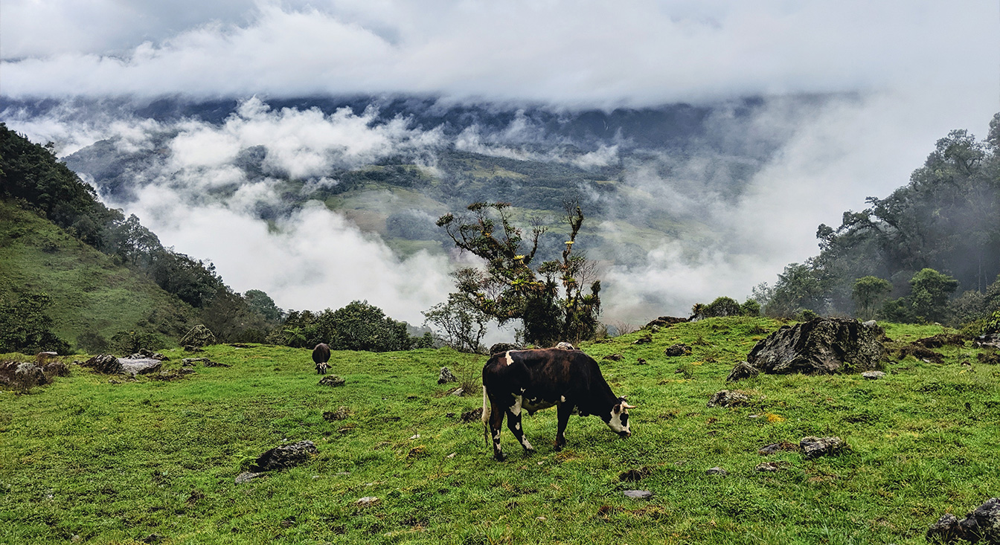

# Template excel file 
Below is a template data table for you to populate as you listen. You can download it either as a csv or an excel file (they are the same, but the csv version has obviously dropped the excel-specific formatting). 

__Note:__ You don't need to edit the morphospecies column (there are more rows than there are species on the recordings). It is important that you only put numbers in the point columns. If there is no species on a particular point, just leave the cell empty. Try to avoid accidentally putting spaces (" ") in cells you aren't using, and don't add any additional columns. You can put whatever you want in the notes column (it might help, for example, to record some notes about the sound of a particular morphospecies, e.g. "high te-te-te-te", or "descending series of notes").

[Datatable (.xlsx)](files/template_datatable.xlsx)

[Datatable (.csv)](files/template_datatable.csv)

# R scripts
Scripts to read in files, and help format them before drawing plots. The plotting section at the bottom (section 3) has been left blank for you to do.

__Note:__ In the code provided, the file is read in as a ```.csv```. After completing your listening and populating the data table, you will need therefore need to save it as this filetype. You can call it whatever you want, but you need to save it somewhere that you can find, and in the code provided it is read in as a csv. (you can read xlsx files into R directly, but it requires installing additional packages, e.g. xlsx)

If you have __dplyr__ or __tidyverse__ (which contains dplyr) installed, you should use the "_dplyr" version, which should make more sense to you as it is what you will have used in your R course. If you have time, it would be worth quickly installing this package, using ```install.packages("dplyr")```. If you have __dplyr__ installed, download and use:

[format_and_plot_dplyr.R](format_and_plot_dplyr.R)

If you don't have it and don't want to install it, then you can use this (which does the same thing, but in base R):

[format_and_plot.R](format_and_plot.R)

__Note:__ Both scripts make use of __ggplot2__. You don't have to use this, but it will make your life a lot easier if you do. If you don't already have it, you can use ```install.packages("ggplot2")``` to install it. 

# Sound files
## Forest 


## Pasture 




