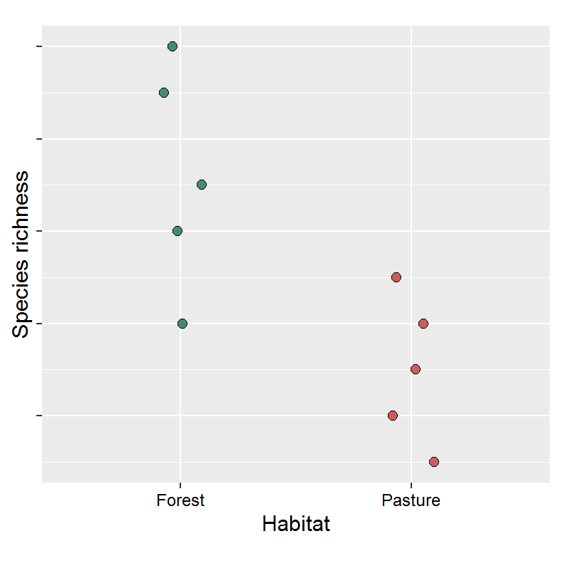
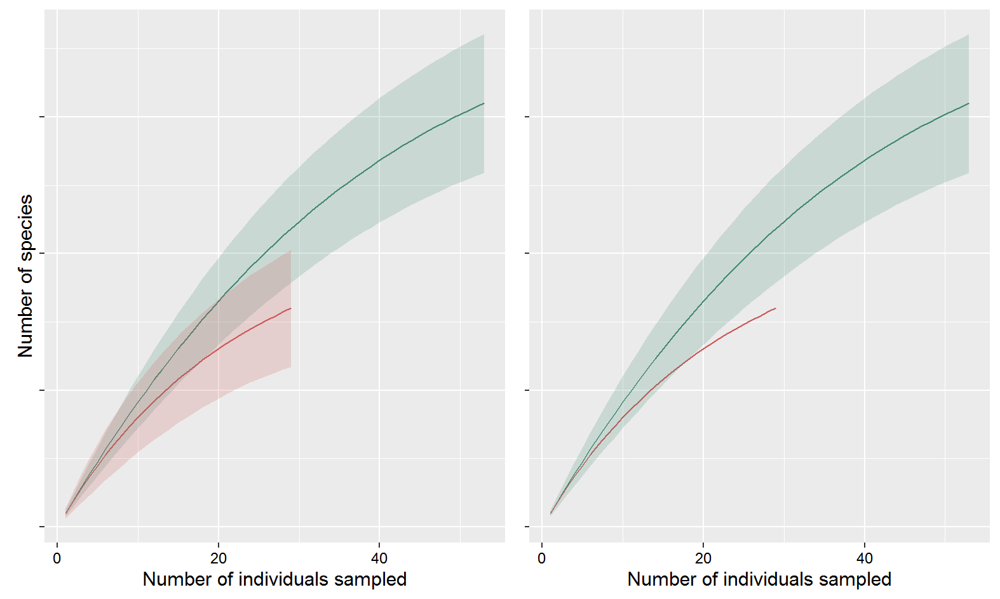

<style type="text/css">
  body{
  font-size: 14pt;
}
</style>

-----

# Getting set up

## Download the zip file
[This zip file](practical_zip.zip) contains all the code and files that you need for this practical, so go ahead and download it now. 

## Open the template datatable
In the ```files``` directory you will fine a ```template_datatable``` file, both as a ```.csv``` and a ```.xlsx```. Open up whichever one you feel like (they are the same, but the csv version has obviously dropped the excel-specific formatting). 

__Important:__ You need to try and make sure that you don't alter the formatting of this datafile. There are 11 columns for you to enter information into, and 45 rows (not including the header). There are more rows than there are species in the recordings, so you don't need to add any rows. You also don't need to edit the morphospecies column, nor should you remove any rows. It is important that you only put numbers in the point columns. If there isn't a particular species on a particular point, just leave the cell empty. Try to avoid accidentally putting spaces (" ") in cells you aren't using, and don't add any additional columns. You can put whatever you want in the notes column (it might help, for example, to record some notes about the sound of a particular morphospecies, e.g. "high te-te-te-te", or "descending series of notes"). __If you do accidentally do any of these things, you might really struggle when it comes to reading the data into R.__

## Saving your completed datatable
When we have come to the end of the listening section of this practical, you need to save your completed datatable as ```completed_datatable.csv``` (note that you have to save it as a csv), in the ```files``` directory (the same place you read the template version in from). You won't be able to read it in if you don't do this.

-----

# Sound files

You can listen to the soundfiles here directly, but if you are struggling to play them for some reason, they are also provided in the zip file, in the ```sound_files``` directory.

## Forest 


## Pasture 


-----

# Analysing and plotting the data
We are going to run R remotely on the University of Sheffield server. I'm told you should have had plenty of practice doing this, but if you need any assistance there will be a TA to help. We are going to rely on two packages that you should have already used quite a bit: __dplyr__ and __ggplot2__. If you haven't already got these, you will need to install them using ```install.packages("dplyr")``` or ```install.packages("ggplot2")```. 

You need to open the project ```APS278_practical.Rproj``` (in the zip file you have already downloaded), which should open the ```plotting_script.R``` file (if not, go ahead and open it yourself). 

It should hopefully be pretty self-explanatory. The main problem will be if you have not saved your completed data table as ```completed_datatable.csv```, and/or you have not saved it into the ```files``` directory (where you read ```template_datatable``` from). See script for further debugging tips if you are struggling to read your file in. 

Run the code that is already entered and this run some code to format your data, and you can check that your data were read in properly, and inspect the objects that were created for you. 


## Your task

(1) calculate the average point-level species richness: on average are there more species in forest or pasture?
    - you already have the summary in ```data_summary```: you want to ```group_by()``` and ```summarise``` to get an average for each habitat type
(2) plot the point-level species richness. You only have 5 points in each habitat, so a dot plot or jittered points might be the best way to do this
    - ```geom_jitter()``` or ```geom_dotplot()``` will be useful
(3) calculate the total species richness in each habitat type
    - ```data_longformat``` contains all the information you need for this. 
    - You need the number of unique species per habitat. ```unique(x)``` will give you a vector of the unique values in vector ```x```, and ```length(unique(x))``` will give you the number of unique values in ```x```.
(4) plot the rarefaction curve for species richness
    - See below for what exactly a rarefaction curve is trying to do. You just need to plot the outputs given to you in the ```pred_both``` tibble. 
    - ```geom_ribbon()``` takes three main ```aes()``` arguments, ```ymin```, ```ymax```, and ```x```. You will probably also want to provide it a ```fill``` argument so that it plots different ribbons for each habitat type! 

__Note:__ It might take you a bit of playing around to figure out how to produce some of these plots/summary statistics. If you are really stuck with something, ask a TA for help. If you aren't sure about what arguments you need to provide to a plotting function, you can also check the documentation by using ```?geom_jitter```. The Aesthetics section tells you what arguments you need to provide to it. 

## Example figures
These are the plots that I have drawn from my listening to these points. Note that yours will probably look different, depending on how well you have been able to identify species on the recordings. Try to recreate them as best as you can (you can edit the format as you like, pick a colour scheme, etc.)

Note that I have removed the labels on the y-axis as it gives the game away!

### Point-level species richness:
<center>
{ width=70% }
</center>
### Rarefaction curves for each habitat:


__What is a rarefaction curve?__ the rarefaction curve is estimating the species richness you would expect to see in a random sample of $m$ individuals in a particular habitat. In habitats where there are lots of individuals, but very few species, we expect to see a curve that is very flat (as each additional individual is likely to be from a species we have already seen). At the other extreme, if every new individual is a new species, we expect to see a 1:1 line as the number of species increases in lockstep with the number of individuals. At some point we expect all curves to plateau, as there has to be a finite number of species in any given community. The closer we are to a plateau, the closer we are to having exhaustively sampled the community. Or that's the idea, at least. 

__Why do we use them?__ We will rarely have observed exactly the same number of individuals in different habitat types, and we need a way of making a fair comparison when you have more individuals in one sample than another. The more individuals you have observed, the more chance you have had to spot a new species, so by chance alone you expect to see more species with increasing $m$. If you want to make a species-richness comparison between two habitats while standardising for the number of individuals, you can use a rarefaction curve. Note that here we have number of individuals on the x-axis, but in other contexts we might consider adjusting for varying surveying effort in other ways, for example by number of points visited, or length of time surveyed, etc. 

__What is the shaded area? And why the difference between these two figures?__ The shaded area indicates the variation in average species richnesses that we would expect to see by chance. This is also called the sampling variation in the expected species richness. If we can calculate this for each habitat type (left-hand figure), why have I also produced a plot where this range is only presented for the forest? 

If our question is "is the species richness lower/higher in forest than pasture", we want to know whether we can statistically differentiate between pasture and forest communities. To put this another way: could the observed richness in pasture plausibly have been generated through random sampling of the forest community?

In forest we observed a lot more species (or at least I did!), so the question is: if we had observed the same number of individuals in forest as in pasture, do we observe more/fewer species in pasture than we would expect by chance? To do this, we can treat our species richness in pasture as known- it's simply what we observed. We can then compare this value to the range of values we would expect to observe through simple sampling variation in forest. If the actual value that we observed lies a very long way away from the range of values that ought to arise through sampling variation then we can conclude that it is very unlikely that our two communities are the same. 

__Important caveats:__

Note that as with any statistical model, the predictions that we make are conditional on the assumptions of the statistical model that we use. So while here we would conclude that the two communities are different (and that there are fewer species in pasture than in forest), this conclusion is conditional on the specific details of this particular model. 

We have ignored, for example, that species detection might vary between habitat types, and between points. We have also ignored that each observation is not necessarily independent of another. Imagine for example that a particular species travels around in large flocks: if we observe one individual we are also likely to observe many others! The consequence is that our estimated sampling variation substantially underestimates the true variation that would arise from this overdispersion in abundance. Some of these assumptions don't seem very reasonable, so before we get carried away and start writing our Nature paper, it's important that we acknowledge that this is a substantially oversimplified model of reality. Even if we feel that these assumptions are likely reasonable in this particular instance, it's important to remember that we only have 10 point counts. If our writeup is "effect of pasture conversion between 3000-3500m in the Cundinamarca department of Colombia", that might be okay, but if we are interested in the effect of pasture conversion in the Colombian Andes in general, it would be hard to argue that 10 points is a representative sample of cloud forest. 

