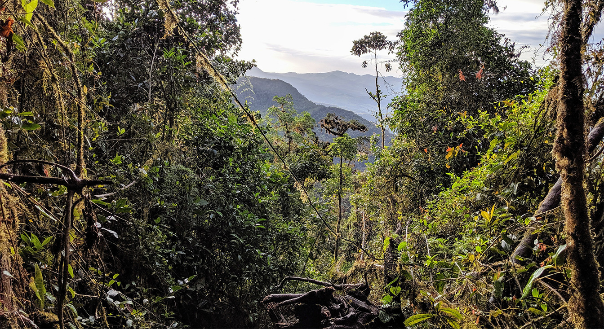

# Template excel file 
Below is a template data table for you to populate as you listen. You can download it either as a csv or an excel file (they are the same, but the csv version has obviously dropped the excel-specific formatting). 

__Note:__ You don't need to edit the morphospecies column (there are more rows than there are species on the recordings). It is important that you only put numbers in the point columns. If there is no species on a particular point, just leave the cell empty. Try to avoid accidentally putting spaces (" ") in cells you aren't using, and don't add any additional columns. You can put whatever you want in the notes column (it might help, for example, to record some notes about the sound of a particular morphospecies, e.g. "high te-te-te-te", or "descending series of notes").

[Datatable (.xlsx)](files/template_datatable.xlsx)

[Datatable (.csv)](files/template_datatable.csv)

You can call it whatever you want, but you need to save it somewhere that you can find, and in the code provided it is read in as a csv. (you can read xlsx files into R directly, but it requires installing additional packages, e.g. xlsx)

# Sound files
## Forest 




## Pasture 


# Analysing and plotting the data
We are going to run R remotely on the University of Sheffield server. I'm told you should have had plenty of practice doing this, but if you need any assistance there will be a TA to help. We are going to rely on two packages that you should have already used quite a bit: __dplyr__ and __ggplot2__. If you haven't already got these, you will need to install them using ```install.packages("dplyr")``` or ```install.packages("ggplot2")```. 

Below, I attach a zip document that contains the scripts for you to read in the files you will need and help format them before plotting. The script that you will need to open is ```format_and_plot.R```. This script will:

(1) read in the ```.csv``` file that you are going to generate as you listen to the recordings. 
(2) reformat this table so that it is in a "long-format" that will be useful for plotting and generating summary statistics
(3) calculate summary statistics and create plots

In step (1) you will need to change the filepath to wherever you have saved your csv. After reading it in, it is important that you run the ```View()``` step. If the dataframe there doesn't look like the one you have just saved then you have a problem and will need to go back and make changes to the file you have created. 

__Note:__ If you are getting errors during the reading in step, then you have probably entered information outside of the cells provided (columns: point_1 to notes, rows 1 to 46). You will need to go back and fix this by deleting rows/columns you have accidentally entered information into. 

Step (2) is done for you, and your main job is step (3). There are 4 main tasks here:

- calculate the average point-level species richness: on average are there more species in forest or pasture?
- plot the point-level species richness. You only have 5 points in each habitat, so a dot plot might be the best way to do this
- calculate the total species richness in each habitat type
- plot the rarefaction curve for species richness

There are some tips provided to help you with each of these, and you can ask a TA for help. 

[format_and_plot_dplyr.R](format_and_plot_dplyr.R)


# Example plots
These are the plots that I have drawn from my listening to these points. Note that yours will probably look different, depending on how well you have been able to identify species on the recordings. Try to recreate them as best as you can (you can edit the format as you like, pick a colour scheme, etc.)

Note that I have removed the labels on the y-axis as it gives the game away!

## Point-level species richness:


## Rarefaction curves for each habitat:


What is the shaded area? And why the difference between these two figures? The shaded area indicates the variation in average species richnesses that we would expect to see by chance. This is also called the sampling variation in our expected species richness. If we can calculate this for each habitat type (left-hand figure), why have I also produced a plot where this range is only presented for the forest? 

If our question is "is the species richness lower/higher in forest than pasture", we want to know whether we can statistically differentiate between pasture and forest communities. To put this another way: could the observed richness in pasture plausibly have been generated through random sampling of the forest community.

In forest we observed a lot more species (or at least I did!), so the question is: if we had observed the same number of individuals in forest as in pasture, do we observe more/fewer species in pasture than we would expect by chance? To do this, we can treat our species richness in pasture as known- it's simply what we observed. We can then compare this value to the range of values we would expect to observe through simple sampling variation in forest. If the actual value that we observed lies a very long way away from the range of values that ought to arise through sampling variation then we can conclude that it is very unlikely that our two communities are the same. 

Note that as with any statistical model, the predictions that we make are conditional on the assumptions of the statistical model that we use. So while here we would conclude that the two communities are different (and that there are fewer species in pasture than in forest), this conclusion is conditional on the specific details of this particular model. 

We have ignored, for example, that species detection might vary between habitat types, and between points. We have also ignored that each observation is not necessarily independent of another. Imagine for example that a particular species travels around in large flocks: if we observe one individual we are also likely to observe many others! The consequence is that our estimated sampling variation substantially underestimates the true variation that would arise from this overdispersion in abundance. Some of these assumptions don't seem very reasonable, so before we get carried away and start writing our Nature paper, it's important that we acknowledge that this is a substantially oversimplified model of reality. Even if we feel that these assumptions are likely reasonable in this particular instance, it's important to remember that we only have 10 point counts. If our writeup is "effect of pasture conversion between 3000-3500m in the Cundinamarca department of Colombia", that might be okay, but if we are interested in the effect of pasture conversion in the Colombian Andes in general, it would be hard to argue that 10 points is a representative sample of cloud forest. 

